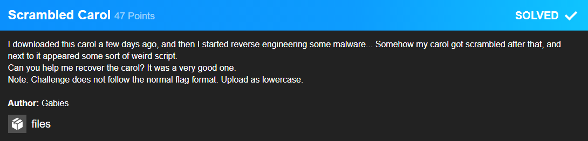

# Scrambled Carol



This challenge consisted of two files. One containing the output aka the scrambled carol and one with the script was was apparently used to scramble this carol. As another note we were told that the original carol was written in English.

On closer inspection of the script I found the following:


```python
def get_seed(size):
    return int(os.urandom(size).hex(), 16)

seed = get_seed(4)
random.seed(seed)
```
The script uses proper pseudo randomness that is non reversable.

```python
old_sigma = "0123456789abcdef"
new_sigma = list(old_sigma)
random.shuffle(new_sigma)
new_sigma = ''.join(new_sigma)
for alpha in input_data:
    encoded = (bytes(alpha.encode()).hex())
    output_data += new_sigma[old_sigma.index(encoded[0])]
    output_data += new_sigma[old_sigma.index(encoded[1])]
```
Each nibble of the input is mapped on specific output nibble.

**Reminder**: 1 nibble = 4 bit $\implies$ 1 Byte = 2 nibble

This means that each hex character gets mapped onto a new hex char. If you would try to brute force a solution you would potentially need $16!$ tries as there are that many permutations of all hex chars. As this is not a feasible attack vector I had the idea to crack the "encryption" using a frequency analysis on the output.

Counting the amount each different byte occured resulted in this:
|24|12|209|11|7|2|212|9|...|
|---|---|---|---|---|---|---|---|---|
|210|113|78|77|77|69|67|67|...|

As you can see `24` or `0x18` occured suspiciously often. 
So it is safe to assume that those are probably spaces.
I started creating a python script that replaces all known nibbles and if for a byte both nibbles are known the char can be displayed. For all others it would display a `?`.
With only the spaces showing I could already feel that this was a good choice and the flag would probably be the last word.
```raw
? ???? ?????? ??? ????? ??? ???????? ??????????? ?? ??? ????? ?? ??? ???? ????????? ??????????? ??? ??? ????? ?? ??? ??? ????? ???????????? ?? ???????? ??? ??? ???? ???? ??? ???????? ?????? ?? ????? ??? ????? ????? ????????????? ?????? ?????? ? ??? ??? ???????? ??????????? ?? ???? ?????? ? ???? ??? ????? ????????? ????? ??????? ? ????? ???? ?????? ??? ??????? ????? ??????? ? ?????? ? ????? ???????????? ?? ??? ????? ?? ????? ???????? ????????????? ??????? ?????? ?? ??? ?????? ?? ????????? ??? ?? ????? ?? ? ???? ??????? ?????????????? ???? ??? ???? ??? ???? ??? ?????? ????????? ???? ?? ????? ??? ???? ?? ????? ?????????? ??? ??? ?????? ???? ?? ?? ??? ??????????? ????? ??? ????? ?? ??? ?????????? ?? ???????????????? ???? ????? ?????? ??? ????? ???????????? ???? ????? ?????? ??? ????? ???????????? ?? ?????? ?? ?? ???? ??? ???????????? ??? ?? ???? ??? ??? ?????? ?? ????????????? ????? ?? ????? ??? ??? ????? ?? ??? ???????????? ?? ??? ???? ??? ?????????? ????? ???????????? ????? ?? ??? ?? ???????? ?????? ????? ??????? ??? ?????? ?? ?????? ??? ???? ????????????? ?? ??? ????? ? ?????? ??? ???? ???????????? ????? ??? ????? ???????? ????????????? ????? ??? ????? ???????? ????????? ?????? ????? ??? ??????? ?? ??????? ?? ???? ????????? ???? ?? ?????????????????????????????????
```
The next most common byte was `12` or `0x0c`. As the most common letter in English (and most other languages using the latin alphabet) is `e` I knew two more nibbles to replace. This resultes in also `b` and `f` showing up.

Next I was told the flag format was `xmassomestringinlowercase`. So I knew the four characters `x`, `m`, `a` and `s`.

Now I had already collected nine of 16 nibbles! Most of the carol was already showing up and even partly readable.

```raw
? h??? ??gh?! ?he s?ars are br?gh??? sh????g???? ?s ?he ??gh? ?f ?ur ?ear Sav??ur's b?r?h?????g ?a? ?he w?r?? ?? s?? a?? err?r p????g?????? ?e appear'? a?? ?he s?u? fe?? ??s w?r?h??? ?hr??? ?f h?pe? ?he wear? w?r?? re???ces????r ????er brea?s a ?ew a?? g??r??us m?r?????a?? ?? ??ur ??ees! ? hear ?he a?ge? v??ces!?? ??gh? ??v??e? ? ??gh? whe? ?hr?s? was b?r???? ??gh? ??v??e? ? ??gh?? ? ??gh? ??v??e????e? b? ?he ??gh? ?f ?a??h sere?e?? beam??g??W??h g??w??g hear?s b? ??s cra??e we s?a????S? ?e? b? ??gh? ?f a s?ar swee??? g?eam??g???ere c?me ?he w?se me? fr?m ?he ?r?e?? ?a?????he ???g ?f ???gs ?a? ?hus ?? ??w?? ma?ger???? a?? ?ur ?r?a?s b?r? ?? be ?ur fr?e??????e ???ws ?ur ?ee?? ?? ?ur wea??esses ?? s?ra?ger???eh??? ??ur ???g! ?ef?re ??m ??w?? be??!??eh??? ??ur ???g? ?ef?re ??m ??w?? be??!???ru?? ?e ?augh? us ?? ??ve ??e a???her????s ?aw ?s ??ve a?? ??s g?spe? ?s peace???ha??s sha?? ?e brea? f?r ?he s?ave ?s ?ur br??her????? ?? ??s ?ame a?? ?ppress??? sha?? cease??Swee? h?m?s ?f ??? ?? gra?efu? ch?rus ra?se we???e? a?? w??h?? us pra?se ??s h??? ?ame????hr?s? ?s ?he ??r?! ? pra?se ??s ?ame f?rever????s p?wer a?? g??r? everm?re pr?c?a?m????s p?wer a?? g??r? everm?re pr?c?a?m? ???h?s car?? was e?c??e? ?? garbage b? ??sP ga?g???he f?ag ?s xmaswas?everasg???as???s?h?s?ear?
```
The last nibbles could be found by simply guessing letter based on the context.

After all I got this script capable of decoding the entire carol including the flag!

```python
with open("output.txt", "r") as in_file:
    input_data = in_file.read()

findings = {}
inputt = []
found = {"1" : "2", "8" : "0", "0" : "6", "c" : "5", "d" : "7", "e" : "8", "a" : "d", "9" : "1", "4" : "3", "2" : "e", "b" : "f", "5" : "c", "3" : "4", "7" : "9", "f" : "a"}

for i in range(0, len(input_data), 2):
    j = int(input_data[i] + input_data[i+1], 16)
    inputt.append(input_data[i] + input_data[i+1])
    findings[j] = findings[j]+1 if findings.get(j) else 1

#findings = dict(sorted(findings.items(), reverse=True, key=lambda item: item[1]))
inputt = [(found[x[0]] if found.get(x[0]) else ".")+(found[x[1]] if found.get(x[1]) else ".") for x in inputt]
inputt = ["?" if "." in x else chr(int(x,16)) for x in inputt]

#print(findings)
print(*inputt, sep='')
```
Running this script finally gave me a nice carol and a flag.
```raw
O holy night! The stars are brightly shining,
It is the night of our dear Saviour's birth.
Long lay the world in sin and error pining,
Till He appear'd and the soul felt its worth.
A thrill of hope, the weary world rejoices,
For yonder breaks a new and glorious morn.

Fall on your knees! O hear the angel voices!
O night divine, O night when Christ was born;
O night divine, O night, O night Divine.

Led by the light of Faith serenely beaming,
With glowing hearts by His cradle we stand.
So led by light of a star sweetly gleaming,
Here come the wise men from the Orient land.
The King of Kings lay thus in lowly manger;
In all our trials born to be our friend.

He knows our need, to our weaknesses no stranger,
Behold your King! Before Him lowly bend!
Behold your King, Before Him lowly bend!

Truly He taught us to love one another;
His law is love and His gospel is peace.
Chains shall He break for the slave is our brother;
And in His name all oppression shall cease.
Sweet hymns of joy in grateful chorus raise we,
Let all within us praise His holy name.

Christ is the Lord! O praise His Name forever,
His power and glory evermore proclaim.
His power and glory evermore proclaim.

This carol was encoded to garbage by HTsP gang.
The flag is xmaswasneverasgoodasitisthisyear
```

### Flag: xmaswasneverasgoodasitisthisyear

