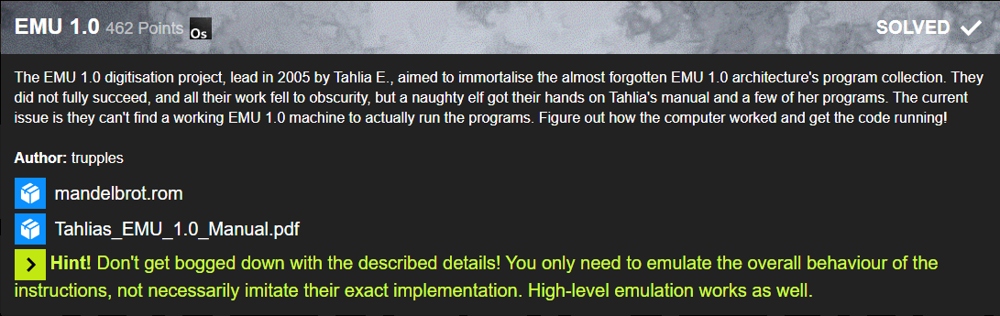

# EMU 1.0

This challenge was as staight forward was all emulation challenges. You get the specsheet of the computer architecutre and start implementing.

When one finished implementing the emulator and ran the given ROM on it the following should happen:

The serial interface needs to read 4 bytes before continuing. If the first two bytes are `Y` and `E` the emulator will print the flag otherwise just jibberish.

The source code for my emulator will be published at a later time after I cleaned the code.

### Flag: `X-MAS{EMU~L3G3ND5~N#VER_D1E}`
