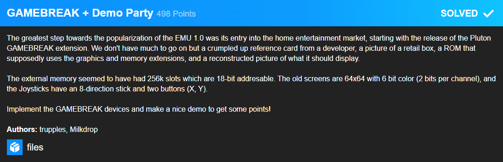
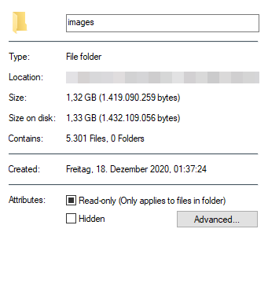
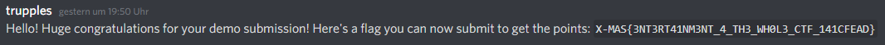

# GAMEBREAK + Demo Party


This challenge required you to implement a video interface for the emulator and write a custom ROM to run on it.
Yet again the source code for my emulator will be bulished at a later time.

I really liked the `Rick.rom` by team `Redstone Blockchain` from last years XMAS CTF and after confirming with one of their members that they were not doing the same this year my idea was there.

I wanted to convert the entire `Never gonna give you up` music video to run on EMU 1.0.

First I needed to write an assembler be able to compile source files to ROM files. As the manual was not specific about the `i` for immediate values being actual part of the assembly or not I simple made it a requirement similar to ARM assembler needing a `#` for immediate values. This made parsing a lot easier.

My assembler can be found [here](https://gist.github.com/Gamer92000/99c0f47bccc3ecd54d03ed1b139ffd96).

Next I started by creating a test image in PPM format from my team's logo and writing a converter to the assembly.

```python
instructions = []
with open("input.ppm", "rb") as f:
    inp = f.read()
    inp = inp.split(b"\n", 4)[-1]
    instructions += "io r0, i3, r63\n"
    instructions += "add r63, r0, i1\n"
    instructions += "add r2, r0, i0\n"
    for i in range(64):
        instructions += "io r0, i22, r2\n"
        instructions += "add r1, r0, i0\n"
        colors = inp[64*3*i:64*3*(i+1)]
        for j in range(64):
            r = (colors[j*3] >>6) <<4
            g = (colors[j*3+1] >>6) <<2
            b = (colors[j*3+2] >>6)
            color = r | g | b
            instructions += f"add r3, r0, i{color}\n"
            instructions += "io r0, i21, r1\n"
            instructions += "io r0, i23, r3\n"
            instructions += "add r1, r1, i1\n"
        instructions += "add r2, r2, i1\n"
    instructions += "lbl 3000, 0\n"
    instructions += "io r60, i3, r0\n"
    instructions += "cmpul r60, i4\n"
    instructions += "+jup 3000, r0\n"
```
As there were 5301 images in the entire video this took quite some time to convert all images and resulted in some data...



As each image was it's own programm they could be individually compiled and later be concatenated. Now I just had to build a fancy intro consisting of some logos fading in and out like on those early consoles. I chose my team's logo followed by HTsP's logo and lastly the Half Life 3 logo. On this I made the text `x to start` blink by simply jumping between the two images with and without the text. Then I waited for the user to press `x` and started playing the video. After the video finished it would simply restart the ROM and yet again go through all to logos to the start screen.


After the voting ended and I came in second just after `Paint by Quphoria` I got a lovely message from `trupples`.



My full ROM can be found [here](https://drive.google.com/file/d/1gTIdccExgAIlOvMXDCDSgInF8xbjFKTy).

### Flag: `X-MAS{3NT3RT41NM3NT_4_TH3_WH0L3_CTF_141CFEAD}`
