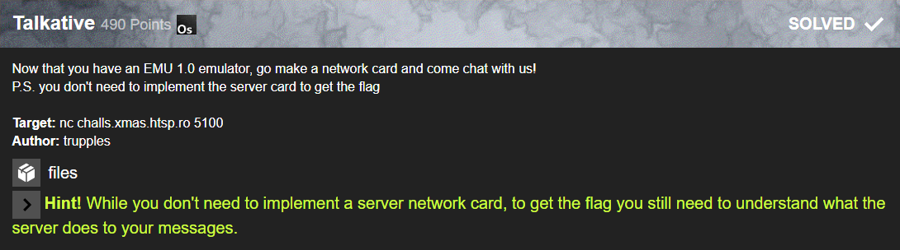

# Talkative


This challenge required you to add a network interface to your emulator. This should then communicate with a given but redacted server ROM via a given client rom and upon correct input the server should return the flag.

As I could not be bothered to implement a network interface into my `c++` emulator I started by writing a simple and incomplete [decompiler](https://gist.github.com/Gamer92000/c7fb9b881de771a43801dabed838e8b0) to get a feeling of what the server ROM is actually doing.

Running this on the server ROM yielded promissing results.

```arm
  add  r12,  r0, i61   //  r12 = 61
  add  r13,  r0, i36   //  r13 = 36
  lbl       512,   0   // 512:
  add   r1,  r0,  i2   //  r1  =  2
  io    r0, i11,  r1   //  i11.send(r1)  internal marker magic
  io    r1,  i8,  r0   //  r1 = i8.getAmount()
  cmpul      r1, i40   //  if (r1 < 40)
+ jup       512,  r0   //    goto/\ 512
  add  r50,  r0, i62   //  r50 = 62
  io    r8,  i9,  r0   //  r8  = i9.recv()
  io    r9,  i9,  r0   //  r9  = i9.recv()
  io   r10,  i9,  r0   //  r10 = i9.recv()
  io   r11,  i9,  r0   //  r11 = i9.recv()
  add   r2,  r0, i14   //  r2 = 14
  lbl       513,   0   // 513:
  io    r1,  i9,  r0   //  r1 = i9.recv()
  st    r1,  r2,  i0   //  r[r2] = r1
  add   r2,  r2,  i1   //  r2 += 1
  cmpul      r2, i50   //  if (r2 < 50)
+ jup       513,  r0   //    goto/\ 513
  add   r2,  r0,  i8   //  r2 = 8
  lbl       513,   0   // 513:
  ld    r1,  r2,  r0   //  r1 = r2
  io    r0,  i2,  r1   //  serial.write(r1)
  add   r2,  r2,  i1   //  r2 += 1
  cmpul      r2, i51   //  if (r2 < 51)
+ jup       513,  r0   //    goto/\ 513
  cmpeq      r0,  r0   //  if (1)
+ cmpeq     r24, i36   //   if (r24 == 36)
+ cmpeq     r21, i36   //    if (r21 == 36)
+ cmpeq     r40, i10   //     if (r40 == 10)
+ cmpeq     r45, i21   //      if (r45 == 21)
+ cmpeq     r11, i28   //       if (r11 == 28)
+ cmpeq     r27, i29   //        if (r27 == 29)
+ cmpeq     r23, i14   //    [...]
+ cmpeq     r39, i22
+ cmpeq     r34, i10
+ cmpeq     r29, i14
+ cmpeq     r14, i18
+ cmpeq     r35, i23
+ cmpeq     r43, i21
+ cmpeq      r9, i22
+ cmpeq      r8, i34
+ cmpeq     r17, i18
+ cmpeq     r18, i16
+ cmpeq     r36, i36
+ cmpeq     r47, i21
+ cmpeq     r20, i29
+ cmpeq     r44, i24
+ cmpeq     r16, i22
+ cmpeq     r15, i36
+ cmpeq     r22, i11
+ cmpeq     r38, i38
+ cmpeq     r48, i24
+ cmpeq     r26, i14
+ cmpeq     r49, i21
+ cmpeq     r37, i33
+ cmpeq     r46, i24
+ cmpeq     r32, i29
+ cmpeq     r25, i11
+ cmpeq     r41, i28
+ cmpeq     r19, i17
+ cmpeq     r33, i17
+ cmpeq     r31, i36
+ cmpeq     r28, i29
+ cmpeq     r10, i10
+ cmpeq     r42, i36
+ cmpeq     r30, i27
+ jdn      4095,  r0
  add   r1,  r0,  i1
  io    r0, i11,  r1
  lbl       513,   0
  add   r1,  r0, i33
  io    r0,  i2,  r1
  add   r1,  r0,  i2
  io    r1, i11,  r1
  cmpeq      r1,  i1
+ jdn       513,  r0
  add   r2,  r0,  i8
  lbl       514,   0
  ld    r1,  r2,  r0
  io    r0, i10,  r1
  add   r2,  r2,  i1
  cmpul      r2, i51
+ jup       514,  r0
  jup       513,  r0
  lbl       513,   0
  jdn       512,  r0
  lbl      4095,   0
  add   r8,  r0, i33
  add   r9,  r0, i38
  add  r10,  r0, i22
  add  r11,  r0, i10
  add  r12,  r0, i28
  add  r13,  r0, i48
```

With a little understanding of the processor you could quickly see it was receiving 40 bytes and comparing them to fixed values.

So I quickly wrote a python script to send those 40 bytes to the server and decode the answer with the processors serial char set:

```python
import socket

translator = ['0', '1', '2', '3', '4', '5', '6', '7', '8', '9', 'A', 'B', 'C', 'D', 'E', 'F', 'G', 'H', 'I', 'J', 'K', 'L', 'M', 'N', 'O', 'P', 'Q', 'R', 'S', 'T', 'U', 'V', 'W', 'X', 'Y', 'Z', ' ', '+', '-', '*', '/', '<', '=', '>', '(', ')', '[', ']', '{', '}', '#', '$', '_', '?', '|', '^', '&', '!', '~', ',', '.', ':', '\n', '@']

l = [34,22,10,28,18,36,22,18,16,17,29,36,11,14,36,11,14,29,29,14,27,36,29,17,10,23,36,33,38,22,10,28,36,21,24,21,24,21,24,21]

print(*list(map(lambda a: translator[a], l)), sep='')

s = socket.create_connection(("challs.xmas.htsp.ro", 5100))
s.sendall(bytes(l))
print(*list(map(lambda a: translator[a], s.recv(2020))), sep='')
```

This printed the input I send followed by the answer I received from the server:

```raw
YMASI MIGHT BE BETTER THAN X-MAS LOLOLOL
X-MAS{Y0U-$UR3-AS-H#LL-4REN#T!!1!!}
```
So in the end no emulator was needed for this challenge, just a deep understanding of the architecture.

### Flag: `X-MAS{Y0U-$UR3-AS-H#LL-4REN#T!!1!!}`
