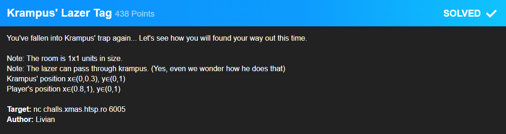
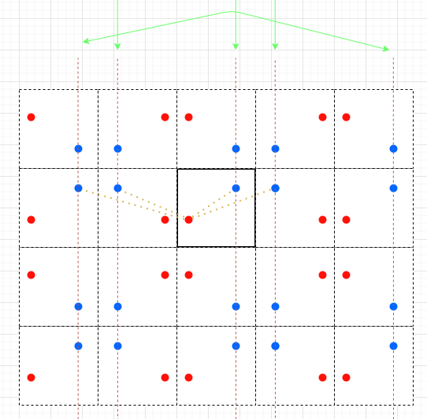

# Krampus' Lazer Tag



This challenge required some math and logic thinking. You basically needed to find all possible intersections of paths from one point to another in a unit room while all walls are perfect mirrors.

**Reminder**: A unit room is a room (in this case a square) with side length of 1.

For easier calculations you can actually mirror one point a a given wall and mirror the intersection point back along the same wall if it is not in the bound of the original unit room.

This resulted in a lot of tired confusion and stupidity on my part. After some time I came up with this visualisation.


From that I could build my python solver script that actually was mathematically correct.

```python
import socket

def build(player, krampus):
    playerX, playerY   = list(map(float,player.split(",")))
    krampusX, krampusY = list(map(float,krampus.split(",")))
    blockers = []
    directX      = (krampusX + playerX)/2
    singleRightX = (2 - playerX + krampusX)/2
    singleRightX = singleRightX if singleRightX <1 else (2-singleRightX)
    singleLeftX  = (krampusX - playerX)/2
    singleLeftX  = singleLeftX if singleLeftX >0 else -singleLeftX
    doubleLeftX  = -(-2 + playerX + krampusX)/2
    directY      = (krampusY + playerY)/2
    singleTopY   = (2 - playerY + krampusY)/2
    singleTopY   = singleTopY if singleTopY <1 else (2-singleTopY)
    singleBotY   = (krampusY - playerY)/2
    singleBotY   = singleBotY if singleBotY >0 else -singleBotY
    doubleBotY  = -(-2 + playerY + krampusY)/2
    blockers.append((directX, directY))
    blockers.append((directX, singleTopY))
    blockers.append((directX, singleBotY))
    blockers.append((directX, doubleBotY))
    blockers.append((singleLeftX, directY))
    blockers.append((singleLeftX, singleBotY))
    blockers.append((singleLeftX, singleTopY))
    blockers.append((singleLeftX, doubleBotY))
    blockers.append((singleRightX, directY))
    blockers.append((singleRightX, singleBotY))
    blockers.append((singleRightX, singleTopY))
    blockers.append((singleRightX, doubleBotY))
    blockers.append((doubleLeftX, directY))
    blockers.append((doubleLeftX, singleBotY))
    blockers.append((doubleLeftX, singleTopY))
    blockers.append((doubleLeftX, doubleBotY))
    
    blockers = [str(round(x[0], 10))+","+str(round(x[1], 10)) for x in blockers]
    return blockers

s = socket.create_connection(("challs.xmas.htsp.ro", 6005))
s.recv(4096).decode()
s.sendall(b"\n")

while 1:
    inp = s.recv(4096).decode()
    print(inp)
    parsed = [x.split(": ")[1] for x in inp.split("\n")[-3:-1]]
    solution = "\n".join(build(parsed[0], parsed[1]))+"\n"
    s.sendall(solution.encode())
```

When running this it solved all given challenges correctly and printed the flag.

### Flag: `X-MAS{Wh3n_11F3_5h0Ot5_14Z3r5_a7_y0U_28f901ab}`
