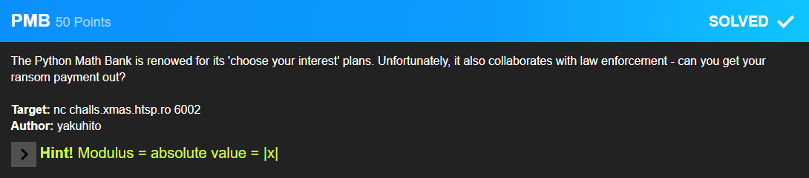

# Python Math Bank



The Python Math Bank was an interesting challenge. It expected you to input a number thats absolute value is less than 100.

```raw
#########################
#  _____  __  __ ____   #
# |  __ \|  \/  |  _ \  #
# | |__) | \  / | |_) | #
# |  ___/| |\/| |  _ <  #
# | |    | |  | | |_) | #
# |_|    |_|  |_|____/  #
#                       #
#########################
Welcome to our hacker-friendly terminal service!
This program is a part of our 'friendlier products for hackers' initiative.
Please select an action:
1. Open account
2. Report account
*you select 1*
That's great! As you probably know, our bank provides anonymous choose-your-interest-rate accounts.
Please keep in mind that the interest rate can be *any* number as long as its modulus is less than 100.
Interest:
```

The suspicious part about this is the emphasis on the word `any`.

When entering $x \in \R : x > -100 \land x < 100$ this resulted in all money being confiscated lastely by month 2.
However upon entering `nan` I could observe the following:
```raw
Month 1
-------
Balance: $(nan+nanj)
Your account has been reported by an anonymous user. CIA confiscated your funds.
Balance: $(nan+nanj)

Month 2
-------
Balance: $(nan+nanj)
Your account has been reported by an anonymous user. FBI confiscated your funds.
Balance: $(nan+nanj)

Month 3
-------
Balance: $(nan+nanj)
Your account has been reported by an anonymous user. INTERPOL confiscated your funds.
Balance: $(nan+nanj)

Month 4
-------
Balance: $(nan+nanj)
*you want to buy a flag for $10 million*
ERROR: Not enough funds.
```

This is nice to see as python displays complex numbers using $x + yj$. So let's try to enter a complex number.
After some trial and error - I could not be bothered to mathematically think about this - I quickly found that a great enough imaginary part with no real part results in a positive real part in month 4. So after I chose a big enough imaginary part I became rich.

```raw
Month 1
-------
Balance: $99000j
Your account has been reported by an anonymous user. CIA confiscated your funds.
Balance: $99000j

Month 2
-------
Balance: $-9801000.0
Your account has been reported by an anonymous user. FBI confiscated your funds.
Balance: $-9801000.0

Month 3
-------
Balance: $(-0-970299000j)
Your account has been reported by an anonymous user. INTERPOL confiscated your funds.
Balance: $(-0-970299000j)

Month 4
-------
Balance: $96059601000.0
*you want to buy a flag for $10 million*
GG!
X-MAS{th4t_1s_4n_1nt3r3st1ng_1nt3r3st_r4t3-0116c512b7615456}
```

### Flag: `X-MAS{th4t_1s_4n_1nt3r3st1ng_1nt3r3st_r4t3-0116c512b7615456}`
