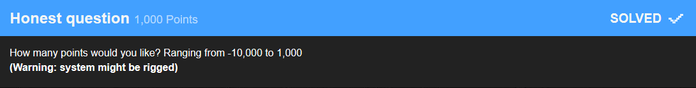

# Honest Question

The actual challenge here was not to find a flag but rather a number that would not reduce but increase your score.

On my test profile I tried the following:

Entered|Score 
---:|---: 
1000|-1000 
0|0 
-10000|-10000 
-1000|1000 

As the description states 
> ranging from -10,000 to 1,000

I stoppend there and submitted `-1000` for `1000` points.

### Flag: `-1000`