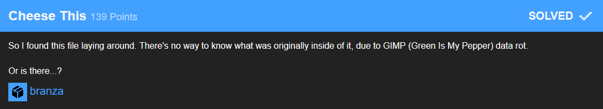
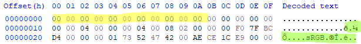
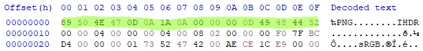

# Cheese This

Data rot usually is a problem with images. When opening an image with any program the filetype should get detected by the first few bytes of the image.
Opening this however just showed the following:

Having a look at the hex of the aleged image we found that the first few bytes went missing (yellow highlighted) and that the image is in fact a png (green highlighted)

Replacing those emty bytes with correct ones

revealed this image:

With a litte trial and error we managed to get the flag correctly:

### Flag: `X-MAS{You_are_g00d_w1th_gu3551ng}`