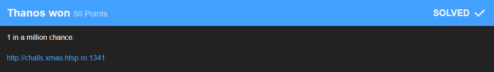

# Thanos won



The description says it all.
You just had to refresh the webpage until you received the flag.
As I am not a maniac sitting here refreshing one webpage a million times I just build a little script to do so for me.

```python
import requests
import re
from time import sleep
URL = "http://challs.xmas.htsp.ro:1341/"

p = re.compile('[^(NO)]*NO.*') # unnecessary compicated ( .*NO.* had been sufficient)

while True:
    sleep(0.1) # needed to prevent "503 Service Temporarily Unavailable"
    r = requests.get(url = URL) 
    if (p.match(r.text)): continue
    print (r.text)
    break
```

This will reload the page until it does not contain "NO" anymore. 
This was a little risky because if the flag contained "NO" it would not have stopped but continued indefinitely.
But after just a few seconds it returned this:
```
1337
X-MAS{stay_at_home_and_respect_your_elders}
```

### Flag: `X-MAS{stay_at_home_and_respect_your_elders}`