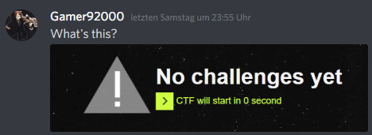
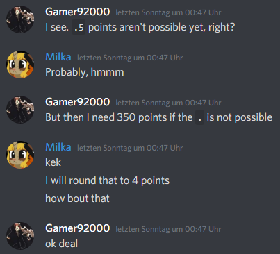

# Gamer92000 swag


This challenge was really easy. All you had to do was message Milkdrop and kindly ask for the flag.


The only problem was Milka aka Milkdrop had a simple security check in place.
It looked something like this:

```c
if( strcmp(message->from, "Gamer92000") != 0 || message->id != 246687234047213568)
    return;
sendFlagTo(message->id);
```
Frankly this is my Discord name and ID! :smirk:

Here's why I got this:






### Flag: `X-MAS{SOMETASICDIUASCISADUCJASDIJCSIODCJSOIC}`