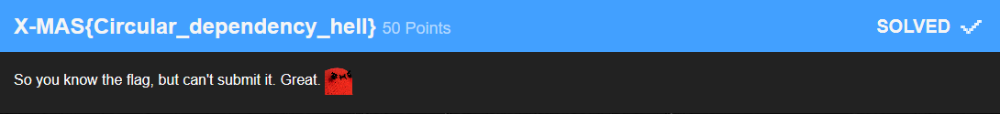

# X-MAS{Circular_dependency_hell}



The flag was given. But how to submit a flag with no input?
Clicking on the challenge showed the id:
`https://xmas.htsp.ro/challenge?id=33`
This could simply be used as a replacement in a different form. Sadly I cannot take any screenshots of this anymore as the forms get hidden after the GTF is over.
It kinda looked like this:
```html

<div class="challenge-submit">
    <form method="post" class="form-flag" action="actions/challenges">
        <input name="flag" id="flag-input-27" type="text" class="flag-input form-control form-group" placeholder="Please enter flag for challenge: Some challenge"></input>
        <input type="hidden" name="challenge" value="27" />
        <input type="hidden" name="action" value="submit_flag" />
        <button id="flag-submit-27" class="btn btn-lg btn-1 flag-submit-button" type="submit" data-countdown="???" data-countdown-done="Submit flag">Submit flag</button>
    </form>
</div>
<!-- code taken from the CTFx repository https://gitlab.com/Milkdrop/ctfx -->
```
```html
<input type="hidden" name="challenge" value="27" />
-> replace with ->
<input type="hidden" name="challenge" value="33" />
```
After replacing `27` with `33` as the value of challenge you could simply enter the flag in the form you hijacked and submit.

### Flag: `X-MAS{Circular_dependency_hell}`